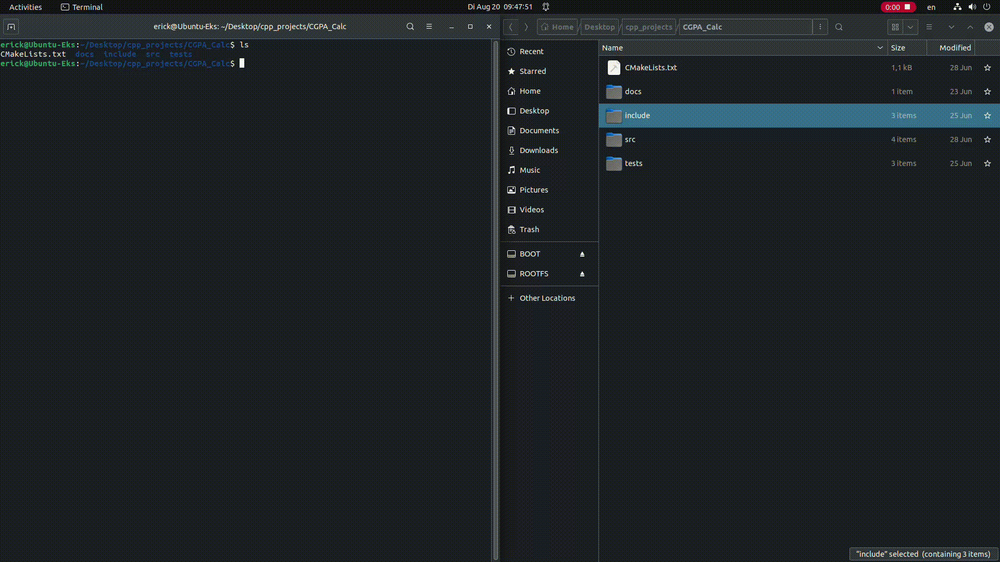

# GPA Calculator - Mini Project

This mini-project is a exploration of the
[BOTAN](https://github.com/Rohde-Schwarz/botan) and [FTXUI](https://github.com/ArthurSonzogni/FTXUI) libraries.

## Overview

The project implements a simple GPA calculator with a user interface built
using the FTXUI library. The Student ID is generated by truncating the "SHA-256"
hash of the student's name.

## Demo

